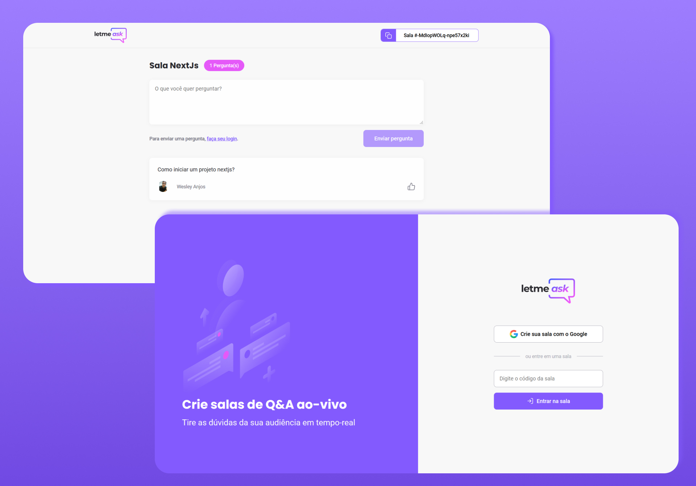

<h1 align="center">
  Letmeask 🗨
</h1>
<h3 align="center">
  Toda pergunta tem uma resposta.
</h3>

<h1 align="center">
  
</h1>

## 📃 Sobre o projeto
Letmeask foi um dos projetos desenvolvimento na semana Next Level Week - Together do dia 20/06 ao 25/06, evento fornecido pela Rocketseat.

A proposta da plataforma é fazer com que usuários realize perguntas enquanto a sala estiver aberta, na parte de visualização do usuário é possível enviar perguntas e curti-las. Na visualização do criador da sala ele tem controle de marcar a pergunta como destaque, respondida ou excluir.


## 🚀 Tecnologias utilizadas
- React
- Typescript
- Firebase
- SASS

## ⚡ Como rodar este projeto
Necessário ter o [Git](https://git-scm.com/) e [Node.js](https://nodejs.org/en/) instalado em sua máquina. Após a instalação, rodar os seguintes comandos:

```bash

## Clone este projeto
$ git clone https://github.com/SrWess/Letmeask-NLW6.git

## Acessa a pasta do projeto
$ cd Letmeask-NLW6

## Intale as dependências com Yarn ou NPM
$ yarn install ou npm install

## Executa aplicação como desenvolvimento
$ yarn start ou npm start

## Projeto será iniciado no seguinte endereço: http://localhost:3000
